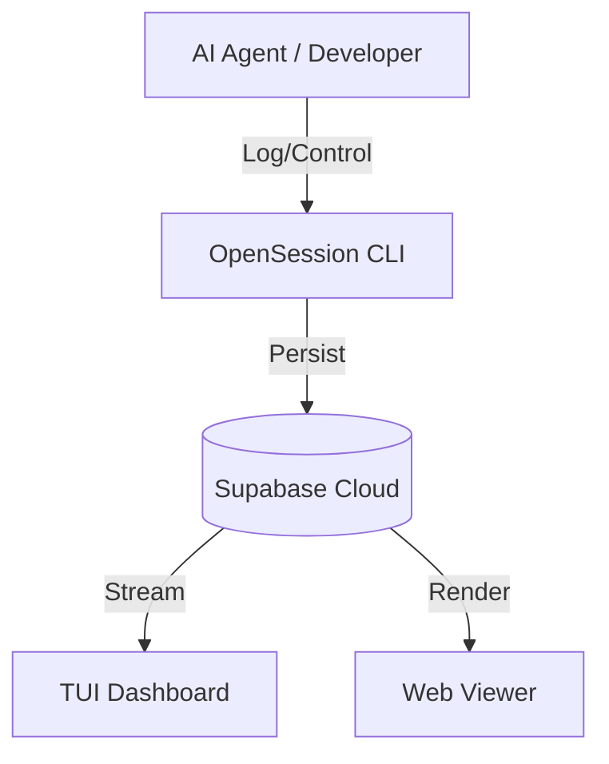

# 🌐 OpenSession

**[English](README.md) | [한국어](README.ko.md)**

> **AI 에이전트 운영을 위한 실행 연속성 계층 (Execution Continuity Layer)**

[](https://www.npmjs.com/package/@online5880/opensession)
[](https://opensource.org/licenses/MIT)
[](#)
[](https://supabase.com)

**OpenSession**은 AI 에이전트가 다양한 도구, 환경, 네트워크 상태 사이에서 작업의 맥락(Context)과 연속성(Continuity)을 잃지 않도록 돕는 **실행 연속성 OS**입니다. 한 번 시작하면 어디서든 재개할 수 있습니다.

---

## 🚀 왜 OpenSession 인가요?

AI 에이전트와 협업할 때 가장 큰 문제는 **"맥락의 단절(Context Fragmentation)"**입니다.
- 로컬에서 작업하던 에이전트를 서버로 옮기면?
- 네트워크 오류로 세션이 끊기면?
- 여러 도구가 각자의 로그를 남겨서 전체 흐름을 파악하기 힘들다면?

**OpenSession은 이 모든 문제를 해결합니다.** 단일 세션 ID로 모든 활동을 Supabase에 영속화하고, CLI/Web/TUI를 통해 끊김 없이 실시간으로 모니터링할 수 있습니다.

---

## ✨ 핵심 기능

### 1. 영속적 세션 모델 (Stable Session Model)
- 어떤 환경에서도 동일한 `session_id`를 사용하여 작업을 이어갑니다.
- `start` -> `pause` -> `resume` 워크플로우를 완벽하게 지원합니다.

### 2. 강력한 이벤트 타임라인 (Durable Event Timeline)
- **의도 (Intent)**: 무엇을 하려고 하는가?
- **액션 (Action)**: 실제 어떤 명령을 실행했는가?
- **결과물 (Artifact)**: 무엇을 만들어냈는가?
- 위 세 가지 핵심 요소를 구조화된 JSON으로 기록하여 심층 분석이 가능합니다.

### 3. 다중 모니터링 인터페이스 (Multi-Surface Monitoring)
- **CLI**: 직관적인 터미널 기반 제어.
- **WebUI (Viewer)**: 브라우저에서 확인하는 고해상도 타임라인 대시보드.
- **TUI (Terminal UI)**: 터미널 안에서 키보드로 조작하는 대화형 대시보드.

### 4. 엔터프라이즈급 신뢰성 (Enterprise-Grade Reliability)
- **멱등성(Idempotency)** 보장: 동일한 이벤트가 중복 기록되는 것을 방지합니다.
- **지수 백오프(Exponential Backoff)**: 불안정한 네트워크 환경에서도 자동으로 재시도합니다.

---

## 🗺️ 로드맵: 3단계 인터페이스

| 단계 (Phase) | 인터페이스 | 상태 | 기능 설명 |
| :--- | :--- | :--- | :--- |
| **Phase 1** | **CLI 코어** | ✅ 안정됨 | 세션 제어, 기본 로깅, 설정 관리 |
| **Phase 2** | **WebUI 뷰어** | ✅ 안정됨 | 다크 테마, 통계(KPI) 리포트, JSON 페이로드 뷰어 |
| **Phase 3** | **인터랙티브 TUI** | ✅ 활성화 | 대화형 세션 선택, 실시간 이벤트 스트리밍 자동 갱신 |

---

## 🛠️ 시작하기

### 설치 및 단축어 설정 (Alias)

빠른 실행을 위해 쉘 프로필에 단축어를 추가하세요:

**macOS / Linux (Bash/Zsh):**
```bash
alias opss='npx -y @online5880/opensession'
```

**Windows (PowerShell):**
```powershell
function opss { npx -y @online5880/opensession @args }
```

### 1분 퀵 스타트

1. **초기화**: Supabase URL과 API 키를 설정합니다.
   ```bash
   opss init
   ```

2. **세션 시작**: 새로운 프로젝트 세션을 시작합니다.
   ```bash
   opss start --project-key my-ai-lab --actor mane
   ```

3. **이벤트 기록**: 에이전트의 활동을 기록합니다.
   ```bash
   opss log --limit 10
   ```

4. **대시보드 실행**: 원하는 뷰어를 선택해 모니터링하세요.
   ```bash
   opss tui      # 터미널 대시보드 (추천)
   opss viewer   # 웹 브라우저 뷰어
   ```

---

## 📖 명령어 가이드

| 명령어 | 단축어 | 설명 |
| :--- | :--- | :--- |
| `init` | `setup` | Supabase 서버 연결 및 로컬 설정을 초기화합니다. |
| `start` | `st` | 새로운 세션을 생성하고 타임라인을 시작합니다. |
| `resume` | `rs` | 멱등성 보호를 통해 기존 세션을 재개합니다. |
| `tui` | - | **(New)** 인터랙티브 터미널 대시보드(TUI)를 실행합니다. |
| `viewer` | `vw` | 로컬 웹 뷰어 서버를 실행합니다 (기본 8787 포트). |
| `status` | `ps` | CLI 버전 정보 및 활성 세션 상태를 확인합니다. |
| `report` | - | 28일간의 KPI 통계 및 주간 트렌드 분석 리포트를 생성합니다. |

---

## 🏗️ 아키텍처

OpenSession은 에이전트 런타임과 영구 스토리지 사이의 **신뢰성 높은 연결 계층**으로 작동합니다.



---

## 🤝 기여하기 (Contributing)

기여는 언제나 환영합니다! 버그 제보 및 기능 제안은 [GitHub Issues](https://github.com/online5880/opensession/issues)를 이용해 주세요.

MIT © [online5880](https://github.com/online5880)
