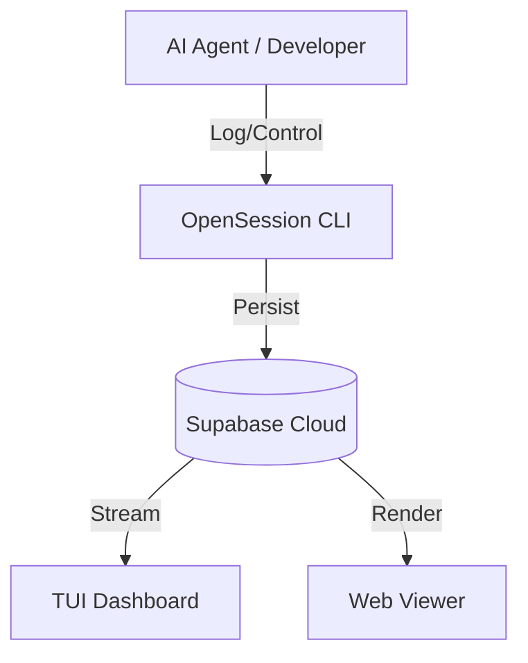

# 🌐 OpenSession

> **The Execution Continuity Layer for AI Agent Operations**

[](https://www.npmjs.com/package/@online5880/opensession)
[](https://opensource.org/licenses/MIT)
[](#)
[](https://supabase.com)

**OpenSession**은 AI 에이전트가 다양한 도구, 환경, 네트워크 상태 사이에서 작업의 맥락(Context)과 연속성(Continuity)을 잃지 않도록 돕는 **실행 연속성 OS**입니다.

---

## 🚀 Why OpenSession?

AI 에이전트와 협업할 때 가장 큰 문제는 **"맥락의 단절"**입니다.
- 로컬에서 작업하던 에이전트를 서버로 옮기면?
- 네트워크 오류로 세션이 끊기면?
- 여러 도구가 각자의 로그를 남겨서 전체 흐름을 파악하기 힘들다면?

**OpenSession은 이 모든 문제를 해결합니다.** 단일 세션 ID로 모든 기록을 Supabase에 영속화하고, CLI/Web/TUI를 통해 실시간으로 모니터링할 수 있습니다.

---

## ✨ Key Capabilities

### 1. Stable Session Model (영속적 세션)
- 어떤 환경에서도 동일한 `session_id`를 사용하여 작업을 이어갑니다.
- `start` -> `pause` -> `resume` 흐름을 완벽하게 지원합니다.

### 2. Durable Event Timeline (이벤트 타임라인)
- **Intent (의도)**: 무엇을 하려고 하는가?
- **Action (액션)**: 실제 어떤 명령을 실행했는가?
- **Artifact (결과물)**: 무엇을 만들어냈는가?
- 위 세 가지 핵심 요소를 구조화된 JSON으로 기록합니다.

### 3. Multi-Surface Monitoring (다중 인터페이스)
- **CLI**: 터미널 기반의 직관적인 제어.
- **WebUI (Viewer)**: 브라우저에서 즐기는 고해상도 타임라인 대시보드.
- **TUI (Terminal UI)**: 터미널 안에서 키보드로 조작하는 대화형 대시보드.

### 4. Enterprise-Grade Reliability (신뢰성)
- **멱등성(Idempotency)** 보장: 중복 이벤트 기록 방지.
- **지수 백오프(Exponential Backoff)**: 불안정한 네트워크에서도 자동 재시도.

---

## 🗺️ Roadmap: The 3-Layer Interface

| Phase | Surface | Status | Features |
| :--- | :--- | :--- | :--- |
| **Phase 1** | **CLI Core** | ✅ Stable | 세션 제어, 기본 로깅, 설정 관리 |
| **Phase 2** | **WebUI Viewer** | ✅ Stable | 다크 테마, 통계(KPI) 리포트, JSON 뷰어 |
| **Phase 3** | **Interactive TUI** | ✅ Active | 대화형 세션 선택, 실시간 이벤트 스트리밍 |

---

## 🛠️ Getting Started

### Installation

```bash
# Global install
npm install -g @online5880/opensession

# Or use without install (NPX)
alias opss='npx -y @online5880/opensession'
```

### 1-Minute Setup

1. **Initialize**: Supabase URL과 API 키를 설정합니다.
   ```bash
   opss init
   ```

2. **Start Session**: 새로운 프로젝트 세션을 시작합니다.
   ```bash
   opss start --project-key my-ai-lab --actor mane
   ```

3. **Log Events**: (API 사용 시) 에이전트의 활동을 기록합니다.
   ```bash
   # CLI를 통한 직접 기록 예시
   opss log --limit 10
   ```

4. **Launch Dashboard**: 원하는 뷰어를 실행하세요.
   ```bash
   opss tui      # 터미널 대시보드 (추천)
   opss viewer   # 웹 브라우저 뷰어
   ```

---

## 📖 Command Reference

| Command | Alias | Description |
| :--- | :--- | :--- |
| `init` | `setup` | Supabase 서버 연결 및 로컬 설정 초기화 |
| `start` | `st` | 새로운 세션 생성 및 타임라인 시작 |
| `resume` | `rs` | 기존 세션 ID를 이용해 작업 재개 |
| `tui` | - | **(New)** 인터랙티브 터미널 대시보드 실행 |
| `viewer` | `vw` | 로컬 웹 뷰어 서버 실행 (기본 8787 포트) |
| `status` | `ps` | 버전 정보 및 현재 활성 세션 상태 확인 |
| `report` | - | 28일간의 KPI 통계 및 주간 트렌드 분석 리포트 |

---

## 🏗️ Architecture

OpenSession은 에이전트 런타임과 스토리지 사이의 **신뢰 계층**으로 작동합니다.



---

## 🛡️ Git Hygiene & Security

- `.opensession/config.json`에는 민감한 API 키가 포함되어 있으므로 절대 Git에 커밋하지 마세요.
- OpenSession은 기본적으로 로컬 설정 파일의 경로를 `~/.opensession`으로 관리합니다.

---

## 🤝 Contributing

버그 제보 및 기능 제안은 [GitHub Issues](https://github.com/online5880/opensession/issues)를 이용해 주세요.

MIT © [online5880](https://github.com/online5880)
