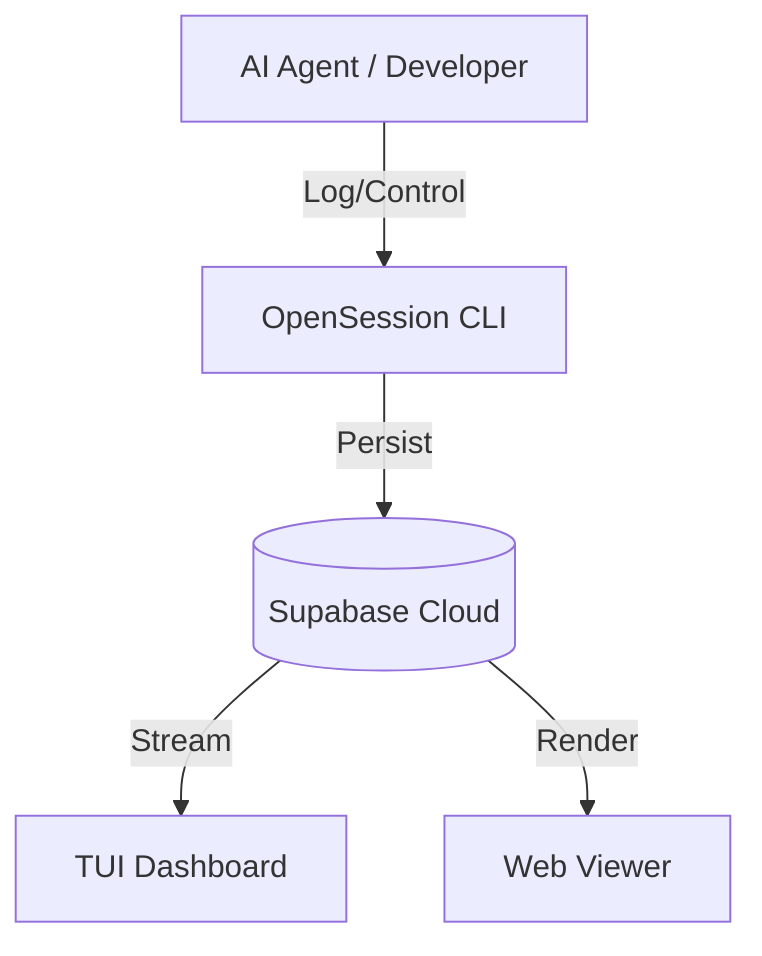

# 🌐 OpenSession

**[English](README.md) | [한국어](README.ko.md)**

> **The Execution Continuity Layer for AI Agent Operations**

[](https://www.npmjs.com/package/@online5880/opensession)
[](https://opensource.org/licenses/MIT)
[](#)
[](https://supabase.com)

**OpenSession** is an execution continuity layer designed to help AI agents maintain context and workflow stability across different tools, environments, and network conditions.

---

## 🚀 Why OpenSession?

The biggest challenge in collaborating with AI agents is **"Context Fragmentation."**
- What happens if you move an agent from local to a remote server?
- What if the session drops due to network issues?
- How do you track the flow across multiple tools with disparate logs?

**OpenSession solves this.** By using a single session ID, all activities are persisted to Supabase, allowing you to monitor and resume work seamlessly via CLI, Web, or TUI.

---

## ✨ Key Capabilities

### 1. Stable Session Model
- Resume work anywhere using the same `session_id`.
- Native support for `start` -> `pause` -> `resume` workflows.

### 2. Durable Event Timeline
- **Intent**: What is the goal?
- **Action**: What command was executed?
- **Artifact**: What was produced?
- All elements are recorded in structured JSON for deep analysis.

### 3. Multi-Surface Monitoring
- **CLI**: Intuitive terminal-based control.
- **WebUI (Viewer)**: High-resolution timeline dashboard in your browser.
- **TUI (Terminal UI)**: Keyboard-driven interactive dashboard inside your terminal.

### 4. Enterprise-Grade Reliability
- **Idempotency**: Prevents duplicate event recording.
- **Exponential Backoff**: Automatic retries for unstable network scenarios.

---

## 🗺️ Roadmap: The 3-Layer Interface

| Phase | Surface | Status | Features |
| :--- | :--- | :--- | :--- |
| **Phase 1** | **CLI Core** | ✅ Stable | Session control, basic logging, config management |
| **Phase 2** | **WebUI Viewer** | ✅ Stable | Dark theme, KPI reports, JSON payload viewer |
| **Phase 3** | **Interactive TUI** | ✅ Active | Real-time session switching, live event streaming |

### Installation & Setup

#### 1. Alias / Function Setup
To use the `opss` shorthand, add the following to your shell profile:

**macOS / Linux (Bash/Zsh):**
```bash
alias opss='npx -y @online5880/opensession'
```

**Windows (PowerShell):**
```powershell
function opss { npx -y @online5880/opensession @args }
```

#### 2. Global Install (Optional)
```bash
npm install -g @online5880/opensession
```

---

## 🚀 1-Minute Quickstart

1. **Initialize**: Set up your Supabase URL and API Key.
   ```bash
   opss init
   ```

2. **Start Session**: Begin a new project session.
   ```bash
   opss start --project-key my-ai-lab --actor mane
   ```

3. **Log Events**: Record agent activities.
   ```bash
   opss log --limit 10
   ```

4. **Launch Dashboard**: Choose your preferred view.
   ```bash
   opss tui      # Terminal dashboard (Recommended)
   opss viewer   # Web browser viewer
   ```

## 🧪 Testing

- Detailed guide: [TESTING.md](TESTING.md) | [한국어 가이드](TESTING.ko.md)

```bash
npm test
npm run e2e
```

- `npm test`: Runs unit and compatibility tests under `test/*.test.js`.
- `npm run e2e`: Runs end-to-end smoke tests for CLI commands and viewer startup/`/health`.

---

## 📖 Command Reference
...
| `tui` | - | **(New)** Launch the interactive Terminal UI dashboard. |
| `viewer` | `vw` | Run a local read-only web viewer server. |
| `status` | `ps` | Check CLI version and active session status. |
| `report` | - | Generate 28-day KPI stats and weekly trend analysis. |

---

## ⌨️ TUI 인터랙티브 조작법

TUI 대시보드(`opss tui`)는 실시간 이벤트 모니터링을 위해 다음 조작이 필요합니다:

- **세션 선택**: `[↑ / ↓]` 화살표 키로 이동 후 **`[Enter]`**를 눌러 선택하세요. 선택된 세션부터 실시간 스트리밍이 시작됩니다.
- **새로고침**: `[R]` 키를 눌러 전체 세션 목록을 새로고침합니다.
- **종료**: `[Q]` 또는 `[Esc]` 키를 눌러 종료합니다.

---


## 🏗️ Architecture

OpenSession acts as a high-reliability bridge between agent runtimes and persistent storage.



---

## 🤝 Contributing

Contributions are welcome! Please use [GitHub Issues](https://github.com/online5880/opensession/issues) for bug reports and feature requests.

MIT © [online5880](https://github.com/online5880)
